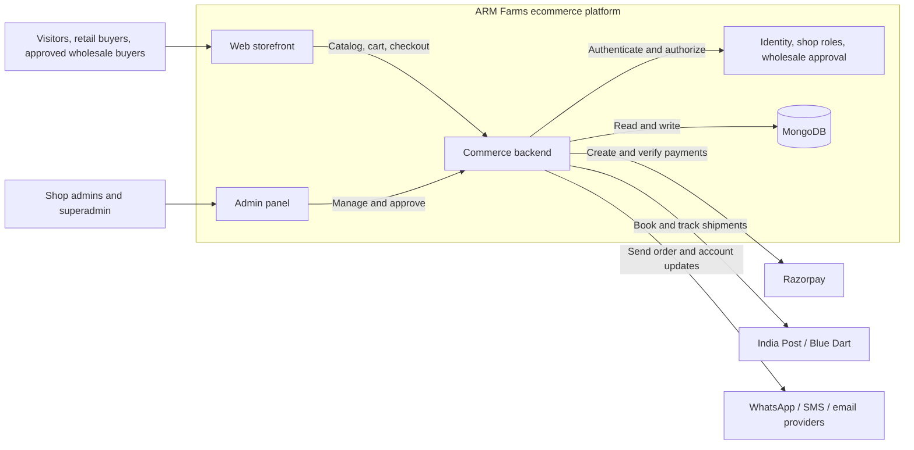

# ARM Farms ecommerce architecture

This is a proposed logical architecture based on the [business requirements](ARM_Farms_BRD.pdf) and the [current MongoDB ERD](democopy.previous.erd.json). Boxes represent responsibilities, not separately deployed services.

The commerce backend handles catalog and audience pricing, inventory, checkout, orders, payments, shipments, returns, and admin actions. MongoDB stores the collections shown in the ERD. Product images and private verification documents need file storage; the provider has not been selected.

## Decisions to settle

- The BRD specifies one warehouse for the initial launch. The ERD supports multiple inventory locations.
- The BRD shows adding to cart before login. The ERD currently supports signed-in carts only.
- The draft BRD leaves GST invoicing, shipping charge calculation, pincode serviceability, and courier selection rules for confirmation.

Open this file in Cursor and use **Ctrl+Shift+V** to preview the diagram.
